# 🚀 Parallax: Amazon ML Challenge 2026 Team Battle Manual

> **Mission:** Secure a top leaderboard position in the Amazon ML Challenge 2026 through disciplined cross-validation, rapid orthogonal prototyping, automated infrastructure, and zero-waste compute allocation.

---

## ⚡ 1. Pre-Flight Checklist (Do Tonight Before Hour 0)

Every team member must verify these 4 items before the challenge starts:

### [ ] 1. Set AWS Region to `us-east-1` (N. Virginia)
* Log in to the [AWS Console](https://console.aws.amazon.com/).
* In the top-right navbar, set region to **US East (N. Virginia) `us-east-1`**.
* *Rationale:* All centralized S3 storage and EC2 compute instances live in `us-east-1`. Same-region EC2 $\leftrightarrow$ S3 communication has **zero data-transfer egress fees** and operates at **10–25 Gbps**.

### [✓] 2. AWS GPU Quota Status: REJECTED (Expected & Accounted For)
* AWS automatically denies GPU instance quotas (`g4dn`/`g5`) on new promotional accounts.
* **Impact on Strategy:** Zero impact. We do not need AWS GPUs. We keep AWS 100% focused on **CPU Spot data downloading (`c6i.xlarge` - 5 vCPU quota approved)** and **Central S3 Storage**.

### [ ] 3. Set Hard Budget Alerts ($180 USD)
Prevent unexpected credit exhaustion across the 3 AWS accounts:
1. Open **AWS Budgets** $\rightarrow$ **Create budget** $\rightarrow$ **Monthly cost budget** (or Zero spend template).
2. Set budget amount: **`$180` USD** (preserving a $20 buffer from your $200 credit).
3. Set alert thresholds at **25% ($45)**, **50% ($90)**, **75% ($135)**, and **90% ($162)** with notifications sent to all 3 teammates.

### [ ] 4. Verify Kaggle GPU Quota (Our Primary Day-1 GPU Engine)
Because AWS GPU is unavailable, **Kaggle is our primary GPU engine for Day 1**:
* Navigate to [kaggle.com/settings](https://www.kaggle.com/settings).
* Ensure phone verification is completed (unlocks 30 hrs/week of NVIDIA T4 / 2x T4 per person).
* $3 \times 30 = \mathbf{90\text{ hours of free GPU compute}}$ (16GB VRAM each, exactly matching AWS `g4dn.xlarge`).

---

## 🗄️ 2. Shared Central S3 Storage Setup

Account #1 hosts the central single source of truth for datasets, golden splits, and model checkpoints.

### Bucket Configuration
* **Bucket Name:** `s3://amazon-ml-2026-parallax-shared`
* **Region:** `us-east-1`
* **Object Ownership:** *Bucket owner enforced*

### Team IAM Credentials
Instead of fragile cross-account IAM role assumptions, Account #1 generates one dedicated IAM User:
1. In AWS Console (Account #1) $\rightarrow$ **IAM** $\rightarrow$ **Users** $\rightarrow$ **Create user** named `parallax-team-storage`.
2. Attach policy: `AmazonS3FullAccess` (or scoped policy for `amazon-ml-2026-parallax-shared`).
3. Create **Access Keys (CLI)** $\rightarrow$ Securely share `AWS_ACCESS_KEY_ID` and `AWS_SECRET_ACCESS_KEY` in the team channel.

### Connecting Teammates (EC2, Kaggle, Local)
Each teammate runs:
```bash
aws configure
# AWS Access Key ID: [PASTE_TEAM_KEY_ID]
# AWS Secret Access Key: [PASTE_TEAM_SECRET_KEY]
# Default region name: us-east-1
# Default output format: json
```

Verify connection:
```bash
# Check bucket access
aws s3 ls s3://amazon-ml-2026-parallax-shared/

# Sync helper using Parallax CLI
uv run python -m parallax.utils.s3_sync list
```

---

## 🏗️ 3. Compute Architecture & Role Division

```
┌────────────────────────────────────────────────────────────────────────┐
│                        COMPUTE ARCHITECTURE                            │
├────────────────────────────────┬───────────────────────────────────────┤
│ Heavy CPU Data Prep & S3       │ AWS EC2 (c6i.xlarge Spot) [Credits]   │
│ Day 1 GPU Prototyping          │ Kaggle (90h Free T4 / 2x T4 GPUs)     │
│ Asynchronous Full Downloads    │ AWS EC2 Background Detached tmux      │
│ Day 2 Heavy 5-Fold Training    │ College DGX Cluster (A100 / V100)     │
│ Final Ensembling & Submission  │ Local + Kaggle / AWS G4dn             │
└────────────────────────────────┴───────────────────────────────────────┘
```

### Team Roles & Responsibilities

| Teammate | Focus Area | Day 1 Milestone | Key Deliverables |
|---|---|---|---|
| **Teammate A (Infra & Tabular/Rules)** | Data pipeline, S3 sync, Regex engine, and submission validation. | Full image download running in tmux, Golden Split published to S3, baseline Submission #1. | `downloader.py`, `rules.py`, `validator.py`, `verify_submission.py` |
| **Teammate B (NLP / Text Specialist)** | Text representation, tokenization, catalog description features. | DeBERTa-v3 / modern LLM baseline evaluated on Golden Split. | `src/parallax/models/text.py`, text CV score |
| **Teammate C (Vision / OCR Specialist)** | Product image understanding, OCR extraction, multimodal alignment. | Florence-2 / PaddleOCR / timm visual feature baseline on Golden Split. | `src/parallax/models/vision.py`, vision CV score |

---

## ⏱️ 4. Day 1 Hour-by-Hour Timeline

```mermaid
gantt
    title Day 1 Battle Schedule
    dateFormat  HH:mm
    axisFormat %H:%M
    section Triage & Pipeline
    Problem Triage & Metric Locking   :00:00, 1h
    Create Golden Split & Launch Full Download :01:00, 1h
    section Prototyping
    Parallel Model Shootout (Text vs Vision vs Rules) :02:00, 4h
    section Submission & Scaling
    Team Sync & Submission #1          :06:00, 1h
    Queue 5-Fold Training for Night   :07:00, 3h
```



### Detailed Protocol

* **Hour 0.0 – 1.0 (Problem & Metric Triage):**
  * Read challenge rules, format specifications, and evaluation metric.
  * Implement exact metric formula in `src/parallax/metrics/evaluator.py`.
  * Lock down the Golden Split schema.

* **Hour 1.0 – 2.0 (Golden Split & Downloader Launch):**
  * Download the raw catalog CSV.
  * Run `src/parallax/data/splitter.py` to produce `golden_split_train.parquet` (5,000 rows) and `golden_split_val.parquet` (1,000 rows).
  * Upload the golden split to S3.
  * Launch `src/parallax/data/downloader.py` in a detached `tmux` session on AWS Spot CPU (`c6i.xlarge`) to download full image assets in the background.

* **Hour 2.0 – 6.0 (The Parallel Model Shootout):**
  * Teammates B and C pull the Golden Split into Kaggle notebooks.
  * Teammate A runs deterministic regex/heuristic baseline locally or on AWS.
  * **Rule:** All models MUST evaluate against the identical 1,000-row Golden Validation set using `src/parallax/metrics/evaluator.py`.

* **Hour 6.0 – 7.0 (Team Sync & Submission #1):**
  * Compare validation scores.
  * Combine best predictions (e.g. Text Model + Regex Fallback).
  * Run `src/parallax/submission/validator.py` on `submission_001.csv`.
  * Upload to the competition portal to verify leaderboard pipeline.

* **Hour 7.0+ (Overnight Full-Scale Training):**
  * Scale winning architectures to the full dataset using 5-fold cross-validation.
  * Launch on College DGX (A100s) or AWS EC2 with auto-shutdown enabled.

---

## 🛡️ 5. Golden Rules for the Hackathon

1. **Always Trust Local CV Over Public Leaderboard:**
   * Public leaderboard is typically computed on only 20–30% of the test set. Overfitting to public LB causes massive private LB shakeup.
2. **Never Leave AWS Instances Running:**
   * Append auto-shutdown to long-running scripts:
     ```bash
     uv run python train.py && sudo shutdown -h now
     ```
3. **Always Run Submission Verification:**
   * Never submit without passing `src/parallax/submission/validator.py`. A single null or wrong column name wastes a daily submission limit.
4. **Preserve Separation of Control:**
   * Keep probabilistic model outputs isolated from deterministic formatting, regex normalization, and unit conversion.

---

## 🚨 Emergency Protocols

* **"AWS GPU request is rejected or pending":** Move directly to Kaggle (90 hours free T4 compute across 3 accounts).
* **"College DGX is offline":** Use AWS Spot `c6i.xlarge` for preprocessing and Kaggle/Colab for fine-tuning.
* **"Image download hangs or is throttled":** Use `uv run python -m parallax.data.downloader --concurrency 32 --retry-backoff` on AWS EC2, never local home Wi-Fi.
* **"Submission error on competition portal":** Run `uv run python -m parallax.submission.validator submissions/sub.csv data/raw/sample_submission.csv` to diagnose exact row/column/NaN discrepancies.
